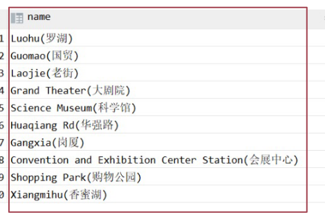

# lec1

## primary key

1. 每行都不一样，如各种id

## Normalization

1. 每栏只包括一条信息，如把姓  名分开两列

## Entity and Relationship

1. 比如电影与演员，不应该在电影里面写演员1 演员2 而是创建一个另外的表relationship来写

# lec2

## Data Definition and Manipulation

1. DDL：定义数据库
2. DML：访问和更新数据，也叫查询语言
3. SQL：结构化查询语言，接收多个表为输入，常常输出一个表，包括DDL和DML

## create tables

1. 

   名字一般不区分大小写

2. 双引号表达是区分大小写的

## data types

#### text

1. char(length) 定长字符串
2. varchar(max length)不定长
3. varchar2（max length）是oracle自己提供的数据类型
   [varchar和varchar2的区别 - 兰溪三日桃花雨 - 博客园 (cnblogs.com)](https://www.cnblogs.com/anningkang/p/oracle.html)
4. clob 很长的text

#### number

1. int
2. float（n）精度为n的浮点数
3. real 浮点数和双精度浮点数
4. numeric（p，d）指定精度为p位，小数点后位d位，一个不一样就不能存

#### date

1. date  YYYY-MM-DD
2. datetime YYYY-MM-DD HH:mm:SS
3. timestamp YYYY-MM-DD HH:mm:SS

#### binary data

1. raw(max length)
2. varbinary(max length)
3. blob  binary large object
4. bytea 用于PostgreSQL

## constraints

1. not null
2. primary key 必填且唯一
3. unique
   //前三个都是可以直接写在后面
4. check 如 check(first_name=upper(first_name))，保证名字都是大写
5. 可以给constraints起名字，便于后面再用，不显式起名字PSQL也会给你起
6. 这都是静态约束，需要时刻满足，一旦约束被写进去，就不能随时自动更新了

## foreign key

1. 这样写，一对多，在《多》的那个东西里面写外键
2. 外键需要出现在关联的键里面
3. 外键和级联更新适用于单机低并发，不适合分布式、高并发集群，有时候会不让用外键，可能会引起数据库更新风暴，外键影响数据库插入速度（因为会引起级联更新，是强阻塞）
4. 

## 更新表格

### insert

​	

### delete

### drop table 

​	"drop table r"

### alter

 1. alter table r add A D
    	A是要添加的属性（列）（attribute）
        	D是数据类型

 2. alter table r drop column A


# lec3

## select

1. select A1, A2, ..., An
   from r1, r2, ..., rm
   where P
2. 有时候选出来的东西就是有重复的，比如电影里选国家，不能用于数几个国家

## String constants

用单引号引起来


## Select without From or Where

1. select 2+4 会出来6，出来的是运行结束的结果，只有一行一列，不确定某个表达式的值的时候用

2. 如果 select 2+4 from movies 出来的是1列，n行（与movie行数相等），内容是2+4的结果，相当于把2+4当成where里面的


# lec4

1. ```sql
   select country from movies
   ```

   这个不一定是relation

2. ```sql
   select distinct country from movies 
   ```

   会得到去重后的

3. ```sql
   select distinct country, year_released from movies
   ```

   是组合不同，可能有同样的国家

## 聚合函数(把多个数聚合成一个数表示)

1. count

2. 聚合函数忽略null，整行是null的时候这行会被忽略

3. ```sql
   select count(title) from movies
   select title from movies
   ```

   数的是下面这行的行数

4. group by，这个复杂度会比较高，经常会包括排序

   ```sql
   //在每个组里展示什么
   select country, count(*)// count number of each group
   from movies
   group by country
   ```

   ```sql
   selest distinct country from movies
   ```

   结果行数一样

5. ```sql
   select country, min(year_released)
   oldest_movie from movies group by country
   ```

   能找到每个国家发布最早的电影是什么时候发布的

   min也是一个聚合函数

6. 复合

   一般从from后面开始写，因为这是数据源，可能有点复杂

7. having可以过滤groupby之后的结果，having之后可以接aggregate function

   where是在前面，而且只能过滤表格里有的列

8. 如果一行全是null，count(\*)会不会返回它，答案是会；如果只是count(id)之类的写列名的话就会忽略null

9. distinct A, B，会选出AB不都一样的

## join

### 从多个表检索数据

1. 'join on' 是一个关键词，on的是join的依据

   ```sql
   select title,country_name,year_released
   from
   	movies m join countries c  --这是两个重命名
   	on c.country_code=m.country
   	where...;
   ```

2. 

   不相等的行只是会出现在虚拟机virtual table（R1*R2）里，结果里面只有黄色的那行

3. natural join：如果有两列名字（两个表）一样，natural join会把它当成key，就是自动帮你选joinkey

   1. 但是有的时候两列名字一样，表达的意思不一定一样

### self join

1. 比如说需要找到有多少对人有一样的first name

   ```sql
   select*
   from people p1 join people p2
   on p1.first_name=p2.first_name
   where p1,peopleid<>p2.peopleid
   ```

### 多个join

```sql
select m.title,c.credited_as,p.first_name,p.surname
from
movies m join credit c on m.movieid=c.movieid 
join people p on c.peopleid=p.peopleid
where m.country='cn';
```


# lec5

1. old join

   ```sql
   select m.title, c.credited_as,p.first_name, p.surname
   from movies m,
   	credits c,
   	people p
   where c.movieid=m.movieid
   	and p.peopleid=c.peopleid
   	and m.country='cn'
   ```

   这玩意容易发现不了错误，可能不小心就会变成很大很大的表

## inner and outer joins

### inner

```sql
from movies 
join countries
on country_code=country
```

### outer

```sql
from table1
LEFT [OUTER] join table2
on table1.column=table2.column;
```

1. left （左表）里面有某个country_code， 但是在右表里面不存在一样的country
   在inner中我们会把它扔掉，但是在left outer join 中，我们会展示左边表格的所有
   对于右边没有的情况，就都补成null

## set operators 一些集合操作，先把两个单独的query运行完，在进行集合操作

### union

1. 就是把两个表格查询的结果竖着合起来，保证列的meaning一致

2. 需要保证列数相同，每列的数据类型相同

3. 一般不这么用，因为可以合并条件，其实用的比较多的是在不同的表上找

4. union will remove duplicated rows，不想remove，可以用union all

   ```sql
   select ...
   from movies limit 5 offset 0
   #取5行，从第0行开始
   ```

### except

1. 从一个表中删掉另一个表有的

### intersect

1. 输出两个表中都有的行

## subquery

### subquery after select

1. 之前学过from后面的subquery，现在学select和where后面的subquery

2. 

   这个本来写country的话只能出countrycode，改成一个select语句的话，会把本来查出来的这一列，每一个都变成这个子语句中 的内容

### subquery after where

1. 

2. 关于 in()

   1. 里面是集合，会自动去重

   2. 可以写 not in 

   3. 里面有null时，要认真对待, 这个会一直false(value=null and value<>null are always not true)

      ```sql
      select 5 not in (1,2,3,4,null)
      => not (5=1 or ... or 5=null )
      => 5<>1 and 5<>2 and...5<>null
      ```

## Update and Delete

### update 更新

```sql
update table_name
set column_name=new_name,
	...
where...
```

**除了select语句之外，写操作，删除等等一定要备份**

1. like  %

   ```sql
   select...where...like 'von%'
   ```

2. replace

   ```sql
   replace(surname,'von','')||'(von)'
   --把surname 中的von改成空，并且在后面加上 (von)
   ```
   
3. 最后整体update

   ```sql
   --先更新哪个表
   update people
   --更新规则
   set surname=replace(surname,'von','')||'(von)'
   --需要更新的列
   where surname like 'von %'
   ```

   

### delete

1. ```sql
   delete from table_name
   where...
   --删除
   ```


# lec6 more about null

## expressions with null values

1. null 相当于unknown

## ordering

### 1. order by

1. 只能根据这一层select出来的列进行order
2. desc降序排列，asc是升序，可省略
3. 
   临时改一下值，不改原表，进行排列
4. 可以按string 字母，数字，日期排列

## null

1. null is greater than anything， 会被放最下面


（如果搞半天没发现错，可以从output里面去看看

## limit and offset

1. ```sql
   limit k offset p
   --返回前k行，跳过前p行
   --p是0时，返回的是从头开始的
   ```


## window function

1. 聚合函数：把一列值映射成一个值，avg,min,max,count

2. 标量函数：scalar function，单个值，返回单个值，如：PPER（将文本转换为大写）、LOWER（将文本转换为小写）、LEN（返回文本字符串的长度）和CONCAT（将多个字符串连接起来）

3. 聚合函数有个问题就是每行的详细信息会被搞丢

4. 格式

   ```sql
   <function> over (partition by <col_p> order by <col_o1, col_o2, ...>)
   ```

   1. function 可以是 ranking window function,或者aggregation function
   2. ranking window function：rank(), dense_rank(), row_number()
   3. Aggregation Functions as Window Functions: max(col), min(col), sum(col), count(col), avg(col),...

5. ```sql
   select m.title, earliset_movie.min_year, earliset_movie.country
   from movies m
            join(
                --这个里面只能有country的min_year，所以需要外面join一层补充详细信息
                select country, min(year_released) min_year
                 from movies
                 group by country) earliset_movie
                on m.year_released = earliset_movie.min_year and m.country = earliset_movie.country;
   ```

6. ```sql
   rank() over (partition by country order by year_released)
   --对每一组的每一行,partition by 按什么分组，order by 每一组中按什么排序
   ```

   这个可以既保持原来的行细节

7. rank()是我们学的第一个window function，代表的含义是对于每个组来说，这一列保留这行在这组的排名

   groupby 会把多行聚合成一行，window function就不会

8. 还有两个其他的rank()

   rank(),dense_rank(), row_number()

9. 使用了window function的是算的这一组的第一行一直到当前行的统计值（如sum(col), count(col), avg(col), stddev(col), etc），后面的数字不管


# lec7讲原理咯，不讲sql咯

## Application Development

1. 应用程序是连接用户与数据库的

2. 要学怎么开发这样的app

   分为三种：前端后端中端

   1. 前端最底层，比测试高一点点

      GUI，forms，很多是web-base


### three-layer web architecture


1. 右边是服务器，web sever是跟网络交互，app server，database sever是接数据库的

### html and http

1. 炸群语言

   1. php是世界上最好的语言
   2. html是一门编程语言，其实是一种标记语言

2. ```html
   <html>
   
   <body>
   	<div>
   		<p>hello world</p>
   	</div>
   </body>
   </html>
   ```

   html语言

### javascript

1. 这东西在浏览器里可以关，但是关了基本上网站都打不开，因为是现代网页脚手架

   ==有一些没看==


### Object-Relational Mapping

1. 把数据库里面的表转化成对象

### web services

1. json是js的object


## Entity-Relationship Model (E-R Model)Entity-Relationship Diagram (E-R Diagram)


the new running example

## design a database model

1. ### 三个阶段

   1. 初始阶段：了解用户究竟要什么功能
   2. 第二阶段：选择数据类型
   3. 最后阶段：从抽象的数据模型到database

2. ### 设计方案

   1. 要避免两个问题：redundancy，incompleteness（不完整性）


# lec8

1. one - to - many :有交点的一边是one，
2. 可以用这样的句子表示，通过这个找到one边，可以用汉语，主要看前面的数量词


# lec9 reduction to relation schemas

1. ​	relation 类似table；
   relationship 是指table间的关系

2. weak entity 会多加几列（强实体集的primary key）

   

   这样可以省一张表
   ，中间这个就不用了

3. 多值属性列需要一些特殊的东西

### Representing Relationship Sets

1. 对于多对多关系，一般搞三个表
2. one to many 可以在many里面加一列表示one那边，就不需要中间这个表了
3. one to one 是one to many的一种情况，所以也可以这么干，随便选一边
4. 如果many边是partial 的，那第一列（对应one的那列）可能有null，有时候有影响有时候没事
5. 

### Design Issues

#### common mistakes in ER diagrams

1. 一些冗余的数据
   

2. 错误的relationship attributes

   1. 如这个，中间这个表有四列，stu,sec,ass,marks，它的primary key 是两个表的primarykey的合体，就是stu sec, 会导致无法表示多个ass，因为不能让几行的主键是一样的

   2. 解决办法：

      1. weak entity sets
         

      2. Composite attributes（这个不一定都支持，比较modern）

         用一个json格式的数据（类似一个数组，把那几行放到一行里面）[{ass1, mark1}, {ass2,mark2}.....]
         

#### Entities vs. Attributes 实体集与属性

1. ，这两种各有好坏，需要权衡，左边更简单，右边适应的场景更多


**ER图可以参考大概这节**


 ==有好多没记==

### Normalization: A First Look，归一化

#### first normal form 1NF 第一范式

1. 原子性：一列里面最好不要是多值
2. 这样就不行

#### 2NF

1. 2NF的前提是满足 1NF
2. 每个属性都应该跟所有的primary key相关，不应该有某一列只跟primary key的真子集有关

#### 3NF

1. 满足2NF

2. 不应该有属性描述的不是primary object，而是描述别的列
   

   primary key是bus_line，但是后面三列描述的是station

3. 


