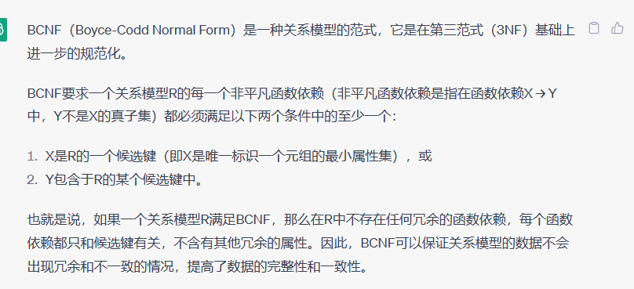
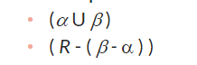

database pricipals and design 7

## keys and functional dependencies

1. K里面的属性如果能决定这个关系中所有的属性，那K就是**superkey**

2. **candidate key**
   

   K的所有真子集都不能决定R时，就已经时candidate key了

3. A->C
   

4. Trivial Functional Dependencie 平凡函数依赖

   

5. 如果下面有一项满足，就是无损分解

6. Dependency Preservation 依赖关系保留

## BCNF

1. 如果
   可以把R分成
2. 第二部分可能还是有问题（不符合BCNF）可能需要循环去做

database pricipals and design 7 的7.4 7.5 7.6 7.7可以自学

## 一些理论与实际

1. 有时候分开会更规范化，但是你总是需要用join的结果来查询，那真正做的时候可能直接不分解
2. 