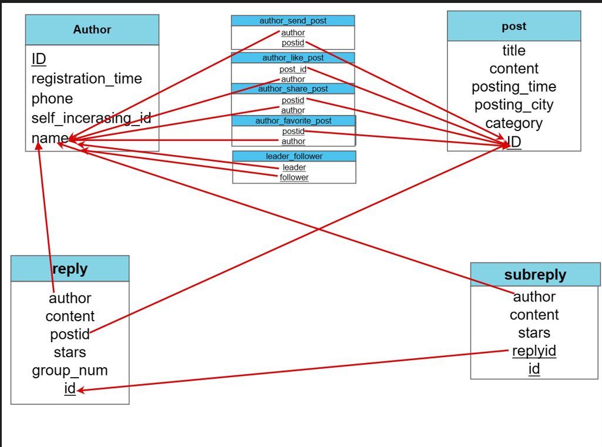
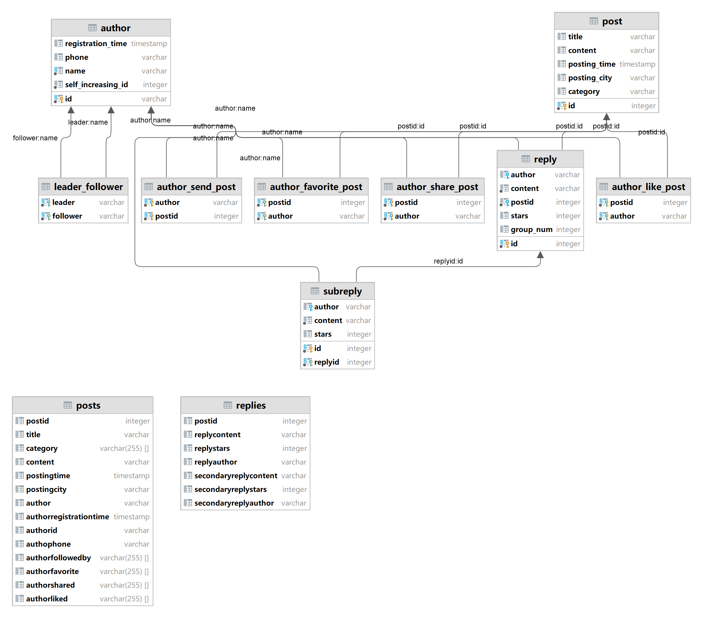

# database projest_1 report

> 12111644 马鑫
>
> 12113001 张晁睿
>
> lab session: 实验2组（周二 5-6节）
>
> 组号：209

## task0 分工

综合来看，我们的贡献占比是一样的

1. E-R图：两人一起
2. 数据库设计：马鑫
3. 数据库建表：马鑫
4. 用java导入数据：马鑫
5. 用sql语句详细处理数据，导入表中：马鑫
6. 数据检查：马鑫
7. 使用json文件->python实例->数据库方法导入数据：张晁睿
8. 使用json->csv->数据库方法导入数据：张晁睿
9. 分析每种导入数据的效率：张晁睿
10. 报告撰写：两人一起

## task1 E-R Diagram

* 制作工具：ppt
* 主键用下划线标出，外键用箭头指出

## task 2 database design

### datagrip生成的ER图：

[ 注释：下面的两个posts和replies表是原始数据导入数据库时使用的，与上面其他的表没有关联。]

#### Notes for the database design部分（满足规定的要求）：

1. 三范式：我们所列的表格中均符合三范式要求，表中的每个属性都是原子性的，不可再分，并且每个属性都只包含1个数据值，author表的主键为id，post的主键为id，Reply表的主键为id，subreply有replyid和id作为主键，几个表的其他属性的值都完全依赖于主键，并且非主键属性之间也并不存在依赖关系，
2. 每个表都可以找到表示关键信息的属性，例如主键和外键部分，author表的主键为id，id在现实生活中作为身份证号可以用来区分每一个人，post的主键为id，同样的每一个帖子都有独立的id值。Reply表的主键为id，这里的id是自动生成的自增id值，用来区分每一条不同的reply，subreply有replyid和id作为主键，其中的id指的是在对应的reply下的序号，可以理解为是每一条reply下面对应的第几条子回复
3. 通过ER图中的箭头表示可以看出，每个表都有满足的外键或者外键指向，满足题目所给的要求
4. 通过ER图，表之间的外键的方向不存在环
5. 结合实际意义，author表中的name属性为not null，post表中的id属性为not null，reply表中的content和postid属性为not null，subreply表中的content属性和replyid属性为not null，满足要求
6. 可拓展性：我们设计的表具有较强的可拓展性：
   ·author，post表为用户进行注册和发表帖子提供了比较便捷的方式，使用者可以直接更改这两个表来起到注册和发帖的实际效果
   ·reply，subreply可以进行拓展，进行回复和子回复的添加
   ·author_send_post,author_like_post,author_share_post,author_favorite_post,表格为用户对贴子进行发帖、喜欢、点赞、收藏的登记提供了便利，leader_follow表格可以使用户之间进行关注

### 具体的数据库设计

1. **author**：表示一个用户，可以发帖，回复，follow others等等，主键为id（字符串类型），表示身份证号
   属性有：id 表示用户的身份证号，字符串类型；
   name，表示用户的名字，是字符串类型；
   registration_time 表示注册时间，是Timestamp类型；
   phone表示用户手机号，是字符串类型；

   author中一部分数据的 id, name, registration_time,phone来自原始表 posts，另一部分name来自Authors Followed By，Authors Who Favorited the Post，Authors Who Shared the Post，Authors Who Liked the Post，Reply Author，Secondary Reply Author，他们的id和registration_time 是随机生成的，其中registration_time 是在已有的最早和最晚之间随机生成一个时间。

   author建好并且直接导入数据后，会有一些重名的人，这是因为在只有name的数据中，没有判断是否已存在这个用户，处理方式是如果有重名的人，就将他们中没有phonenumber的一行删除，因为只有name的用户的phone都是null

2. **post**：表示一个帖子，主键为id(int)，每个post都有一个unique的id；
   属性有：id 表示一个帖子的编号，int类型；
   title 表示post的标题，是字符串类型; 
   content 表示post的内容，是字符串类型；
   posting_time表示发布的时间，是Timestamp类型；
   posting_city表示发布的地点，是字符串类型；
   ==这个删掉了==category表示post的标签，是字符串组成的列表类型。
   post中的数据全部来自于由原始数据导入的《posts》。

3. **reply**：表示某个帖子的一个回复，主键为id（int），是生成的自增id；

   属性有：id 表示回复的编号，所有的任何帖子的回复都有一个唯一的编号；
   author 表示写这个回复的作者，是字符串类型，作为外键指向author中的name；
   content 表示回复内容，字符串类型；
   postid 表示回复的贴子的编号，是int类型，作为外键指向post中的id；
   stars 表示获得的星标数，int类型；
   ==不要这个了==group_num 表示是某个帖子下的第几个回复，对于每个帖子来说，每个回复的group_num是唯一的，因此group_num+postid也可以定位到某个reply；

4. **subreply**：表示一个二级回复，主键是id+replyid，其中id是对于每个reply的编号，一个reply下的subreply的id都不同；
   属性有：==把id改成每个subreply都不一样了==id 表示是某个reply下的第几个二级回复；
   replyid 表示是对于那个reply的回复，int类型，作为外键指向reply的id； 
   author表示发布的作者，作为外键指向author的name

具体代码在“建表语句和数据检查”的“ddl”中。

## task3 data import

### 3.1 basic requirements

1. 导入数据主要使用java脚本将posts和replies两个原始文件导入到数据库（loader_posts和loder_replies），post、reply、subreply数据来自于posts和replies，直接用sql语句插入，author中数据来源较复杂，因此使用java脚本进行导入(loader_author)。
2. 为了方便导入，在loader_author中调用了loader_posts和loader_replies，因此使用时仅需运行loader_author即可，要注意若异地使用，需要修改数据库的用户等信息，需要将一下三个文件放在同一目录下
3. 具体代码在“java脚本导入”中。

###  3.2 脚本优化及效率分析

测试环境：java：idea，python：jupternotebook

java：所有的导入时间均为导入posts.json文件所花费的时间。第一个方法使用每次都需开关与数据库连接的方法进行导入，最后的导入耗时8753ms；在此基础上通过减少数据库连接的创建的方法进行节省时间操作，利用一个链接进行输入数据，测得的运行耗时为48ms，时间明显减少；在此基础上进行预编译处理，一次性编译多条sql语句，每一次执行的时候直接用编译好的内容进行传参，并且在访问服务器硬盘的次数上加快效率，设置为默认情况下不能自动提交，直到运行到commit()命令时才能进行提交，但是由于数据规模较小的原因，时间并没有明显的降低，最终测得的运行结果为50ms，如果数据规模进一步扩大的话所用时间应该有明显的降低。在此基础上进行批处理操作，每次可以传输多条数据，在数据传输效率上进行优化，但是可能由于数据规模的问题，进行操作所用的时间并没有远远小于传输数据所需的时间，最终测量的运行时间结果为99ms。

python：

1. 使用python的json库读取json文件，并将其转换为python对象，之后使用psycopg2的cursor对象进行插入操作，将数据插入到数据库中。
具体的实现中，通过循环遍历 JSON 文件中的每一个数据项，并使用 PostgreSQL 的 INSERT INTO 语句将其插入到数据库中。在插入过程中，使用了 psycopg2 库提供的 execute 方法，将 SQL 语句和参数值传递给 cursor 对象进行执行。最后，通过 commit 方法提交更改并关闭数据库连接。程序运行时间使用 Python 的 time 模块中的 perf_counter 方法计算得到，并将其以毫秒为单位打印出来。
以posts.json文件的导入过程计时，这个文件的导入时间为201.88毫秒

2. 使用python方法将json文件转化为csv文件，之后再将csv文件用python语句导入到数据库中
   以posts.json文件的导入为例：在进行导入之前首先在数据库中创建好表格，然后打开在同一个根目录下的posts.json文件，将json文件的数据写入到csv文件中，再与数据库进行连接，之后按照表数据库表格属性的数据类型对csv文件进行数据类型的处理，最后将csv文件中的数据导入到数据库中。
   这个方法在实现过程中没有达到理想的效果，在连接数据库上出现了问题，已经将python文件转成csv文件，但是在csv文件向数据库导入的过程中出现了问题。在运行时一直有报错，提示csv文件中数据的类型与表格属性的类型不匹配，在尝试了更改数据类型、更改文件中数据的分隔符等多种方法操作后，最后由于时间不充裕，没有成功进行导入。

   具体代码在“python脚本导入”中

### 3.3 Data Accuracy checking

根据要检查的数据写了一些select语句，在“建表语句和数据检查”的“tests”中

