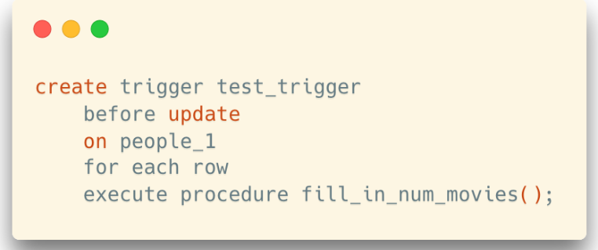
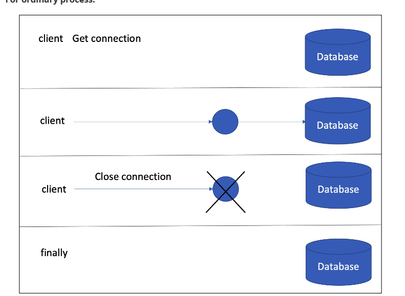
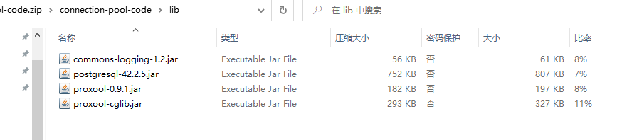
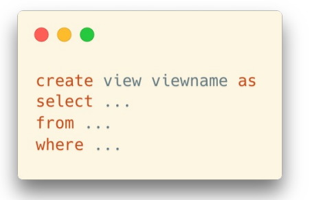
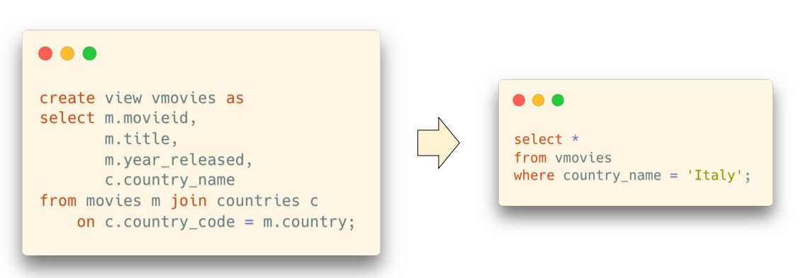
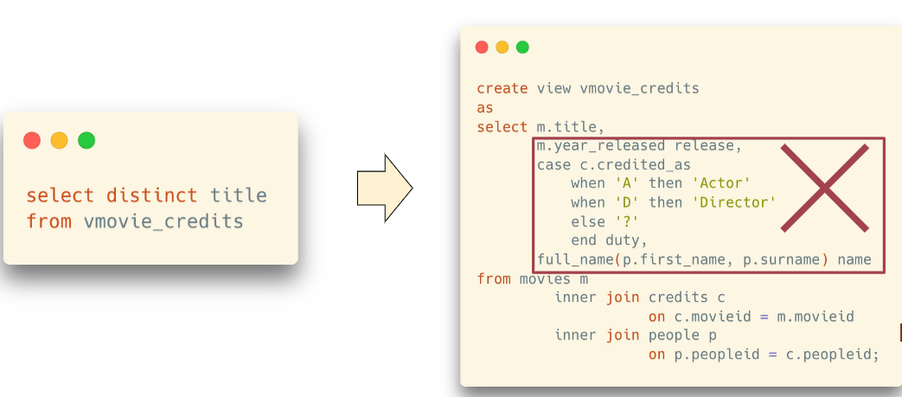

# lab1

都是一些例子，罢了罢了


# lab3

1. 没导入数据的时候可以用 filmdb shenzhen_metroy是另一个库

2. 

3. 配好啦，以后导入直接走34

   ## case

   1. select  
      case when 满足第一种条件 then 返回第一种结果

      ​           when               2                then            2
       else   其他情况

      end 结束case块
      as [name] 给case块起个名字
      from ...
      where....

   2. select 后面的是基于where 筛选过的结果

   3. case 列
                 when 这列数据等=value1时，返回第一种结果
                  when...
      else 这一列的值都不等于when后面的值时，返回一个结果

   4. combine就是给这列起了个名字，叫combine

# lab4

1. ```
   select..筛选列
   from...表名/结果集
   where...筛选行
   group by...不能在where之前，根据where筛选之后的结果进行分组
   having...接在group by之后，对分组之后的结果进一步shai
   ```


# lab5

1. cross join(完全乘)

   ```sql
   select * from T1 cross join T2；
   ```

2. outer join

   ```sql
   select * from T1 left join T2 on T1.A=T2.A;
   ```

3. full outer join：把左右表都保留，没有相对应的就null

4. inner join(join): 只保留匹配的行

5. movies 和 credits 和people可以三个join

   ```sql
   select m.*
   from credits c
            join people p on p.peopleid = c.peopleid
            join movies m on m.movieid = c.movieid
   where c.credited_as = 'D'
     and p.first_name = 'John'
     and p.surname = 'Woo';
   ```

6. 第六题有两层去重

7. 

# lab6

1. union时，要保证上下两个选择的输出格式一样
2. union all 不去重
3. 内层比外层多很多时，用exist，是便利外层的每一行

# lab7

1. over()啥都不加的话是对总的求和，写到每行后面（每行都一样），里面加什么就是按什么求和
2. where是不能用window function的结果的，要用的话必须外面套一层
3. 

# lec8

## NF 范式

1. 第一范式
   1. 一列只一个value，反例：英文名中文名放一起
   2. 两列非常相似的数据要合并，（列于列之间的意义一定要不同）如station1, station2....这个就不符合，应当先搞成一列
2. 第二范式（主要描述多对多）
   1. 所有的列应该与所有的主键相关
      反例：
3. 第三范式（主要一对多）

## comprehensive exercise 12306

1. 

## project

1. 给的是josn文件
2. ER图主要看马老师的要求
3. 不答辩了，只是问问

## lab10

1. ==怎么建一个新的数据库导入数据==

### function

1. 

# lab11

1. trigger创建，每次执行某个语句的时候就执行什么什么
2. 


## proj2

1. 用编程语言：不是sqll
2.  

# lab13

要介绍连接池，用户，view

## 连接池（proj用会youjiafen

1. 客户端：datagrip，脚本
2. 客户端访问服务端首先需要创建一个链接，创建链接是有时间消耗的
3. 使用连接池其实就是在连接池里面有多个数据库链接，可以重复使用，时间消耗大大减少



1. 日志展示
2. 驱动
3. 34是连接池，缺点是只支持jdk1.8，所以要下那个exe
4. 代码在cs307_lab13里面

## view access control

### view

1. 创建视图的基本语法
2. 创建完就可以使用它
3. view vs table
   1. 相当于给select结果起了个名字，每列都可以重命名
   2. 有时候我们需要常常做一个join操作，那我们可以直接创建一个view，每次从这个里面查
   3. view里面的数据是查询实体表得到的，并不是存到了一个新的空间
   4. 使用不当的话会有效率问题，有时候没必要用这个，也许里面操作很多，但我们使用的不需要，如这个就不需要
4. view：每次改变数据，view里的数据就会变
5. materialized view：占用真正的空间，改变数据时不会变

## user

1. step6：用superuser赋予剥夺权限


